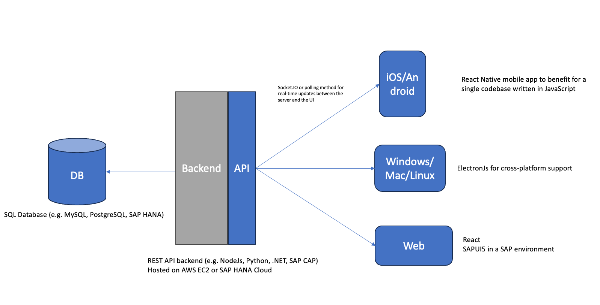

## Equipment Manager

Manage production state of equipment.

### System Diagram

### Run
First run equipment-manager-api and after that equipment-manager-mobile

Backend:

cd equipment-manager-api
npm install
npm start

Frontend:
cd equipment-manager-mobile
npm install
npx expo start